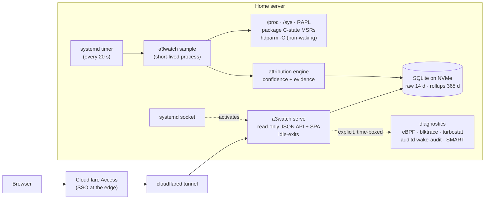

# a3watch

**Home-server observability that never wakes a sleeping disk.**

a3watch answers two questions about a low-power home server: *what just woke my hard drive?* and
*what is all of this costing me?* A dependency-free Python agent samples kernel counters, Intel
RAPL power and package C-state registers every 20 seconds, attributes every HDD spin-up and power
rise to a process, container, or scheduled job — with an explicit confidence level and the
evidence to back it — and serves a SvelteKit dashboard from the same origin, gated by Cloudflare
Access.

It was built for one machine (an Ubuntu box with an NVMe system disk and a set of
mergerfs/SnapRAID HDDs that are meant to spend their lives asleep), but the detect → review →
install flow adapts to any similar Linux server.

## Why it exists

Most monitoring stacks are the problem they claim to solve: SMART pollers spin up standby drives,
resident agents burn watts around the clock, and "what woke the disk?" stays unanswered. a3watch
is designed around three rules:

1. **Non-waking.** The agent never opens a block device. It reads only `/proc` and `/sys`
   pseudo-files, and the single disk command it may issue is `hdparm -C` (ATA CHECK POWER MODE —
   answered by the drive's controller without spinning the platters). This is enforced by a
   run-time command allowlist, verified by a safety self-test that scans the source for
   forbidden patterns, and confirmed on the reference server: full sample cycles left every
   standby disk in standby.
2. **Observe-only.** It changes nothing: no spindown timers, no governors, no power settings.
   Tuning advice is surfaced as text, never applied.
3. **Honest.** Every event carries a confidence level (high / medium / low) and a full evidence
   list. When the cause is genuinely unknowable from cheap signals — deferred writeback, a SMART
   poll that is invisible to block counters, a mergerfs branch ambiguity — it says so instead of
   inventing a culprit.

It also holds itself to account: the agent meters its own CPU time, converts it to watts using a
coefficient learned from RAPL, prices it at the live London electricity rate (Octopus Agile API,
refreshed daily), and reports its running cost in £/year against a configurable budget (default
£5/yr) — on its own dashboard page. On the reference server that self-measured cost is
**≈ £0.004–0.02 a year**: roughly 25 ms of CPU per 20 s cycle, i.e. single-digit milliwatts,
three orders of magnitude under budget.

## What it shows

- **Overview** — package/core wattage, deep-idle status, HDDs asleep vs awake, self-overhead
  £/yr vs budget.
- **Disks** — per-drive activity strips and power-state history, plus a spin-up event timeline;
  each event opens an evidence drawer (block I/O deltas, per-container cgroup I/O, systemd timer
  fires, writeback pressure, spindown policy) with the scored cause.
- **Power & C-states** — RAPL wattage series and core/package C-state residency, including
  attribution of deep-idle stalls (and the honest distinction between "cores never reach C6+"
  and "the package is being held shallow by uncore/PCIe/BIOS limits").
- **Processes** — flagged strays: crash-looping containers, orphans, pollers, top physical-I/O
  and CPU movers with container and command-line context.
- **Server** — general host metrics from pluggable collectors: temperatures and fans (hwmon),
  memory, load, network rates, per-IRQ wakeup rates, container health, filesystem usage and
  SMART health for drives that are already awake.
- **System map** — an auto-discovered, read-only map of the box: Docker containers, networks and
  compose files, the cloudflared tunnel, git repos, systemd units, domains and a bounded home
  directory tree — with token-shaped values redacted before anything leaves the agent.
- **CI/CD** — whether each deployment on the box is current with GitHub, mid-deploy, or behind.
- **Overhead** — the agent's own cost over time.
- **Diagnostics** — explicitly started, time-boxed deep-trace sessions (see below).
- **Settings** — the detected topology and sanitised config.

## How it works



- **Sampling** is a short-lived process fired by a systemd timer — there is no resident daemon.
  Raw counters from the previous cycle are persisted in SQLite, so each run still computes deltas;
  a reboot (boot-id change) discards deltas rather than reporting nonsense.
- **Attribution** correlates whole-disk `/proc/diskstats` deltas, per-PID physical I/O
  (`/proc/<pid>/io`), per-container cgroup v2 `io.stat`, and systemd unit fire times into scored
  spin-up and stay-awake events. A drive is only flagged "stayed awake" if it has a configured
  idle timer that it overstayed — drives that are awake by design are not noise.
- **The API** is stdlib `http.server` behind systemd socket activation: it uses zero resources
  until the first request and exits after two idle minutes. Auth is either a verified Cloudflare
  Access JWT (JWKS, RS256, audience and issuer checked) or a bearer token compared in constant
  time. Every data route is SELECT-only against a read-only database handle.
- **Diagnostics** are the one sanctioned escape hatch: time-boxed (max 300 s) sessions of
  biosnoop/ext4slower (eBPF), bpftrace, blktrace, turbostat, powertop, an auditd-based wake audit
  that names the exact process behind a wake at the syscall level, and SMART. The single tool that
  can wake a disk (`smartctl -a`) demands an extra `confirm_wake` flag.
- **Disk identity is stable.** Drives are followed across `sdX` renames by serial/WWN, pulled
  drives are tracked as absent (so a newcomer taking the old name is never misattributed), and
  newly added drives are auto-discovered passively with the safest default: no commands at all
  until a human reviews them.

## Project structure

```
agent/                  Python agent (stdlib only; Python >= 3.11)
  a3watch/              sampler, attribution, API, CLI, detection, diagnostics
    collect/            pluggable non-waking collectors (thermal, network, IRQ, containers, ...)
  tests/                standalone safety + regression tests (no test framework needed)
  CONTRACT.md           the fixed module/HTTP contract the agent and frontend build against
  install.sh            step 1 of the review-gated install
src/                    SvelteKit 5 dashboard (static SPA, no runtime npm dependencies)
  lib/charts/           hand-rolled SVG charts (line, stacked area, sparkline, activity strip)
  lib/components/       cards, tiles, badges, evidence drawer, nav
  routes/               ten pages (overview, disks, power, processes, map, cicd, ...)
docs/                   feature backlog / design notes
```

## Install

### Agent (on the server)

Requires a Debian/Ubuntu-family Linux with systemd and Python >= 3.11. The install is
deliberately two-step and review-gated — nothing is enabled until you have read the config it
proposes:

```sh
# 1. Copy the agent to /opt/a3watch and run non-waking topology detection.
#    Writes an editable /etc/a3watch/config.toml. No systemd changes, no packages.
sudo agent/install.sh

# 2. Review /etc/a3watch/config.toml — drive roles, protected drives, sampling
#    interval, data dir (must be on the NVMe/SSD; rotational data dirs are refused),
#    CORS origins, Cloudflare Access settings.

# 3. Apply: writes hardened systemd units, generates a 0600 API token,
#    enables the sampling timer and the socket-activated API.
sudo a3watch install --confirm
```

Useful commands (`a3watch --help` for the full surface):

```sh
a3watch status         # live non-waking snapshot in the terminal
a3watch detect         # re-detect topology into the config (review-gated as above)
a3watch diag audit --seconds 60 --wait   # what touched the disks in the last minute?
sudo a3watch uninstall --confirm         # remove units (add --purge to delete data)
```

### Dashboard

```sh
npm install
npm run dev        # local dev server
npm run build      # static build (adapter-static)
npm run check      # svelte-check + typescript
```

The built SPA is served by the agent itself from `<data_dir>/web` (configurable via
`[access].web_root`), so the dashboard and API share one origin behind one Cloudflare Access
hostname — no API URL or token ever appears in the browser. A built-in fallback page is served
until the SPA is installed.

## Configuration

Everything lives in `/etc/a3watch/config.toml` (written by `detect`, meant to be edited):
sampling interval, retention (raw 14 d / rollups 365 d), the self-overhead budget (£/yr), live
electricity-price fetch (Octopus Agile region code, with a configured fallback rate), per-drive
`role`/`protected`/`monitored` flags, API bind/port/CORS, and the Cloudflare Access team domain +
application AUD. The API bearer token is generated separately with `0600` permissions and is
never written into the world-readable config.

`protected = true` on a drive means a3watch will never issue it any command at all — not even the
non-waking `hdparm -C` — and will infer its state passively. Newly hot-added drives get this
safest default automatically until reviewed.

## Tests

The agent ships standalone tests (no framework required):

```sh
python3 agent/tests/test_safety.py           # the non-waking/observe-only guarantees, code-level
python3 agent/tests/test_cstate_spindown.py  # MWAIT C-state decoding; idle timer vs scheduled sleep
python3 agent/tests/test_dev_resolve.py      # drive identity across sdX renames
python3 agent/tests/test_discovery.py        # passive auto-discovery defaults
```

`test_safety.py` is worth reading: it asserts the command gate blocks every disk-waking or
mutating command, then scans every normal-mode module for forbidden source patterns (raw device
opens, `smartctl -a`, `hdparm -S/-y/-I`, governor writes).

## Tech stack

- **Agent**: Python 3.11+ standard library only (SQLite/WAL, `http.server`, `tomllib`); optional
  system-packaged PyJWT solely for Cloudflare Access JWT verification; systemd timer + socket
  activation; hdparm; optional diagnostic tools (bpfcc-tools, bpftrace, blktrace, auditd,
  turbostat, powertop, smartmontools).
- **Dashboard**: SvelteKit 2 / Svelte 5 (runes), TypeScript, Vite, `adapter-static` — a pure
  client-side SPA with zero runtime npm dependencies; all charts are hand-rolled SVG.
- **Edge**: Cloudflare Tunnel (cloudflared, run host-wide by my shared [infra](https://github.com/chrisJuresh/infra) stack) + Cloudflare Access for SSO.

## Status & limitations

- Personal single-server project, built and iterated rapidly in July 2026; actively used on the
  box it was written for. The production instance runs at a3.chrisj.uk behind Cloudflare Access
  and is not publicly reachable. It has already earned its keep there: it surfaced a
  crash-looping Jellyfin container and identified a SMART-polling `scrutiny` instance as a
  disk-waker.
- Some pieces are intentionally specific to that machine: the CI/CD tab's deployable list is
  hardcoded (`agent/a3watch/cicd.py`), role classification understands mergerfs + SnapRAID
  layouts, package C-state MSRs assume an Intel CPU, and the electricity price is the London
  (GSP group C) Octopus Agile tariff — configurable by region, with a fixed-rate fallback.
- Package C-state residency needs root and the `msr` kernel module; without them a3watch reports
  the gap honestly rather than guessing.
- `docs/a3server-admin-feature-backlog.md` tracks candidate future features (activity-gated HDD
  temperatures, an NVMe silent-fill detector, config drift snapshots) and records the deliberate
  decision to stay observe-only.

<!-- screenshot: Overview page — KPI tiles for package power, deep idle, HDDs asleep, £/yr overhead -->
<!-- screenshot: Disks page — activity strips with the evidence drawer open on a spin-up event -->
